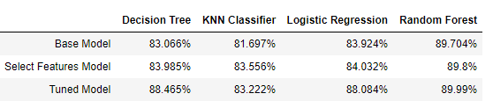

# Machine Learning: Exoplanet Exploration

## Background
Over a period of nine years in deep space, the NASA Kepler space telescope has been out on a planet-hunting mission to discover hidden planets outside of our solar system.

This project uses the data they gathered to train four machine learning (ML) models that are intended to classify candidate exoplanets. 

## Models
### Two Techniques
- Logistic Regression
- KNN Classifier
- Decision Tree
- Random Forest Classifier

### Model Design Approach
- Build a base model using the original dataset and all its 40 features.
- Use the base model to evaluate feature importance, and filter the data to include relevant features only.
- Build a second model (select features model) using the filtered data.
- Tune the model parameters using *GridSearchCV*.
- Build the final model using the tuned parameters. 

## Model Comparison
The Random Forest model was the best model in comparison.  

## Conclusions:
- Random Forest model is the best choice to predict exoplanet candidacy. 
- Various feature selection methods can play significant role.
- Proportionate class data is important. 
- Prediction accuracy for class 0 and 1 is significantly less than class 2 prediction accuracy as class 2 data size almost double compared to class 0 and class 1.
- Lack of domain knowledge played an important role to rely on feature selection techniques which is not necessary a great way of building models.